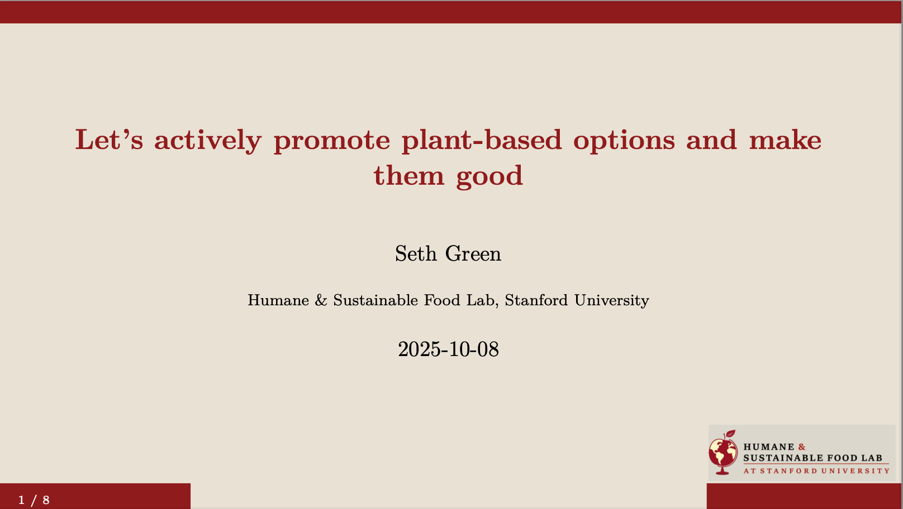

# Food Lab Slides

R Markdown template for creating Beamer presentations with [HSFL colors & logo](https://www.foodlabstanford.com/).

They look like this

{width="75%"}

There's also a sample presentation for the October 2025 Reducetarian summit.

One weird quirk is that you have to download the [HSFL logo](https://github.com/setgree/HSFL-slides/blob/main/inst/rmarkdown/templates/foodlab_presentation/resources/foodlab-logo.png), which I just screenshotted from the website, and add it to your presentation folder. If you can fix that, please do :)

## Installation

``` r
devtools::install_github("setgree/HSFL-slides")
```

## Reqs

-   R (\>= 4.0)
-   RStudio (recommended)
-   LaTeX distribution (TinyTeX, MacTeX, or MiKTeX)
    -   If you don't have LaTeX: `install.packages("tinytex"); tinytex::install_tinytex()`

## Customization

### Colors

The template uses: - **Background**: Beige (#E8E1D3) - **Primary**: Stanford Cardinal (#8C1515) - **Text**: Dark Gray (#2E2D29)

To modify colors, edit `inst/rmarkdown/templates/foodlab_presentation/resources/beamerthemeFoodLab.sty`

### Aspect Ratio

Change from 16:9 to 4:3 in YAML:

``` yaml
classoption: "aspectratio=43"
```

## License

MIT License - free to use and modify for Food Lab presentations.
