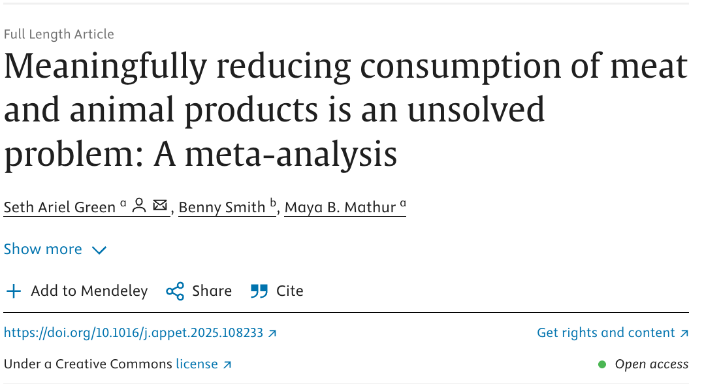
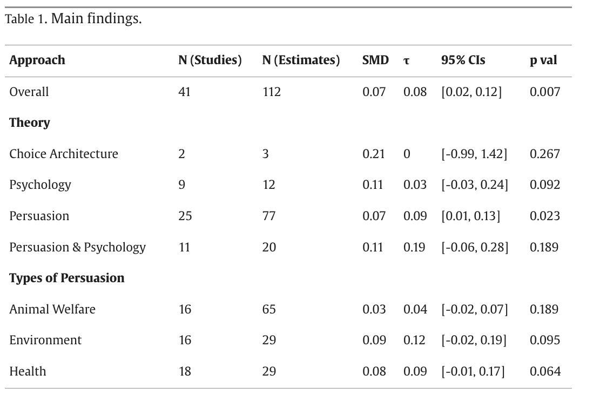
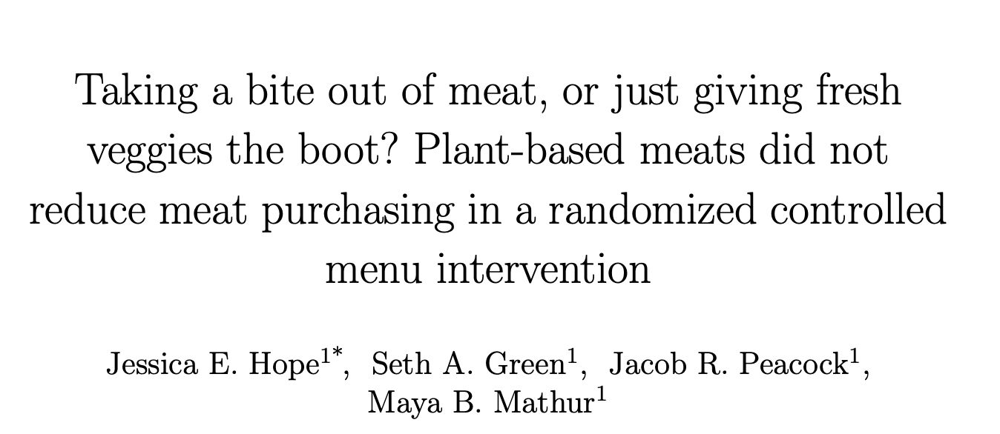
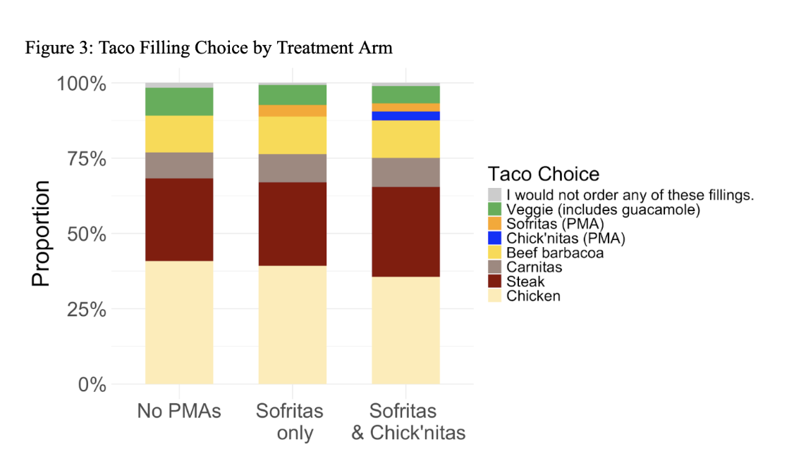

```{r setup, include=FALSE}
# Copy required files from package to working directory

pkg_resources <- system.file("rmarkdown/templates/foodlab_presentation", 
                             package = "foodlabslides")

# Copy theme file
theme_file <- file.path(pkg_resources, "resources/beamerthemeFoodLab.sty")
if (file.exists(theme_file)) {
  file.copy(theme_file, "beamerthemeFoodLab.sty", overwrite = TRUE)
}

# Copy preamble if not already present
preamble_file <- file.path(pkg_resources, "skeleton/preamble.tex")
if (file.exists(preamble_file) && !file.exists("preamble.tex")) {
  file.copy(preamble_file, "preamble.tex", overwrite = FALSE)
}

knitr::opts_chunk$set(echo = FALSE)
```

## ...As opposed to (or in addition to)

1.  saying meat is bad
2.  saying "other people like plant-based options"
3.  making them available without comment

## First, hi I'm Seth

* I'm a researcher at the [Humane and Sustainable Food Lab at Stanford](https://www.foodlabstanford.com/) 

* I write about research on a substack called [Regression to the Meat]( https://regressiontothemeat.substack.com/)

* I've had a really twisty career path which I wrote about one time in an EA forum post called "[My circuitous, undirected path to an EA job](https://forum.effectivealtruism.org/editPost?postId=ekbCzxh2SfA64GrxD&key=075f76549755a048983f916c13a411)" 

* I am generally happy to talk career stuff: setgree@stanford.edu

## Meaningfully reducing consumption of meat and animal products (MAP) is hard

::::: columns
::: column
* Last year I worked on a [big meta-analytic review](https://doi.org/10.1016/j.appet.2025.108233) of interventions to get people to eat less MAP.

* We only looked at rigorous studies (RCTs with \> 50 subjects that measured MAP consumption directly at least a day after treatment began)

* As of 12/2023, 35 papers met our criteria
:::

::: column
{width="100%"}
:::
:::::

## What interventions have been tried?

::: columns
:::: column

* Almost everything tries to:
  - Tell people meat is bad (environmental/health/animal welfare)
  - Make plant-based options more salient (eye-level on menus) 
  - Make animal-based options less convenient
  - Tell people that plant-based options are tasty and their peers like them
  - Exploit psychological tendencies, e.g., to conform or to stick to a plan they've made
* Overall, small & sparse effects

::::
:::: column

{width=100%}

::::
:::

## What about adding new plant-based options to menus?
::: columns
:::: column

* We [tried that too](https://scholar.google.com/citations?view_op=view_citation&hl=en&user=66CRLeoAAAAJ&citation_for_view=66CRLeoAAAAJ:hFOr9nPyWt4C)
* Online, Chipotle-like setting
* Consumers see menus with either 
  - Zero plant-based modern alternatives (PMA) 
  - one (Sofritas)
  - or two (Sofritas & Chickn'itas)
* Outcome is whether they fill a taco with meat or not

::::
::: column

{width=100%}

::::
:::

## Once again we find tiny effects

{width=66%}

* ~1 pp. less meat per PMA 
* Each new PMA cuts back on other plant-based options

## None of these interventions is actively making the case for plant-based options

* Nothing seeks to improve their appeal to the senses/tastes
* Instead we get interventions that tell people ["95% of your classmates think the veggie burger is tasty!"](https://doi.org/10.1016/j.appet.2020.104842)
* or ["60% of your peer group is vegetarian"](https://doi.org/10.1016/j.foodpol.2024.102621)!
  - That's nice! But do I care?
  - Per [Dannenberg et al., 2024](https://doi.org/10.1016/j.foodpol.2024.102621), the answer seems to be no 
  - in fact, men order more meat when their choices are being observed, even if you tell them a majority of their peers are vegetarian

## Let's make the case for plant-based options

* Telling people meat is bad/wrong will probably [reduce meat consumption by ~1-2 pp](https://regressiontothemeat.substack.com/p/expect-1-2-pp-changes-and-you-wont)
* Telling people that more and more of their peers are becoming vegetarian: what happens when they [notice that most people still eat meat](https://regressiontothemeat.substack.com/p/eating-vegetarian-is-not-like-voting)? 
* IMHO the frontier is making [plant-based options delicious](https://regressiontothemeat.substack.com/p/it-helps-if-the-vegan-food-is-delicious) and touting their health benefits
* Address [beliefs about protein](https://substack.com/home/post/p-178094291) head-on!
* Thanks :) Questions?
  